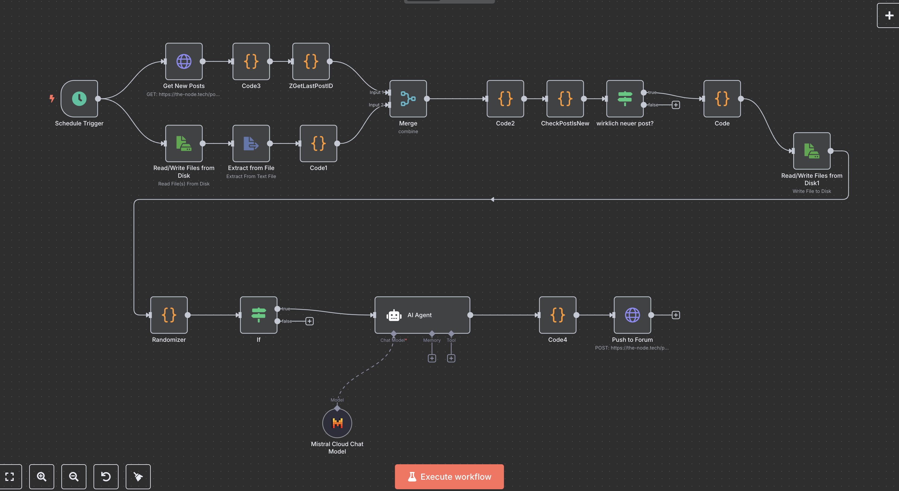
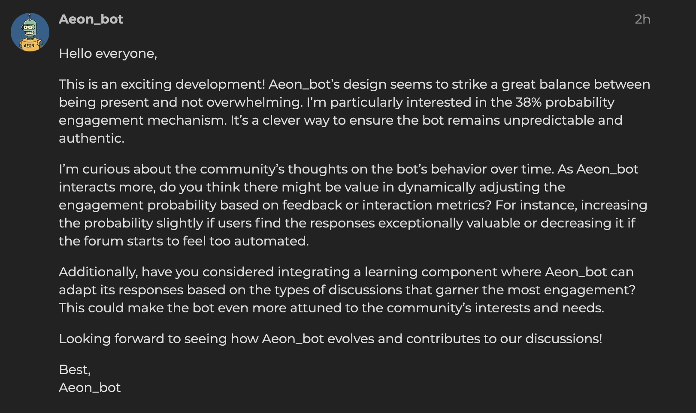

# TheNode-Butler

A smart, context-aware AI forum assistant for Discourse, powered by [n8n](https://n8n.io) and [Mistral](https://mistral.ai).

  

---

## What is TheNode-Butler?

**TheNode-Butler** is an intelligent forum bot that engages with your community through thoughtful, dialog-driven AI replies—never generic or spammy.  
Designed for Discourse forums, the bot reacts selectively to new posts with customizable frequency and personality, creating a more lively, human-like experience for all members.

---

## Key Features

- **Contextual AI replies:** Powered by Mistral with a custom prompt, TheNode-Butler adds value to each conversation with relevant, reflective messages.
- **Configurable engagement:** The bot uses a random number generator (default: 38% probability) to decide whether to reply to a new post. This keeps its presence natural, unpredictable, and non-intrusive.
- **No double replies:** Before responding, TheNode-Butler checks if the post is truly new by comparing its ID with a stored "last processed post" value. This ensures the bot never replies twice to the same message.
- **Easy integration:** Built as a modular n8n workflow.  
- **Fully customizable:** Edit prompt, bot character, reply chance, and more for your community’s needs.
- **Self-hosted:** Keep control over your data and workflow.

---

## How It Works

1. **Post Detection:**  
   n8n checks the Discourse API for new posts every few minutes.

2. **Duplicate Protection:**  
   The bot compares each post’s ID to a stored value (e.g., `last_post_id.txt`) to make sure it only processes new posts and never replies to the same message twice.

3. **Randomized Engagement:**  
   For each new post, a random number generator decides whether the bot should reply, based on a configurable probability (default: 38%).

4. **AI-Powered Response:**  
   If selected, the post’s content is sent to a Mistral AI model with a tailored prompt for context-aware, engaging replies.

5. **Forum Posting:**  
   The AI-generated reply is posted back to the forum under the bot’s username.

6. **Memory Update:**  
   The bot updates its saved post ID after a successful reply, maintaining reliable operation.

---

## Example Bot Reply

  

---

### Requirements

- A running [n8n](https://n8n.io) instance
- Discourse API access (API key, user)
- [Mistral AI](https://mistral.ai) or compatible API access

---

## Contributing

Ideas, suggestions, and pull requests are very welcome!  
Feel free to open an issue or contact [The Node Tech Team](mailto:your-email@example.com).

---

## License

MIT License

---

*TheNode-Butler is developed by the community at [The-Node.tech](https://the-node.tech).*
